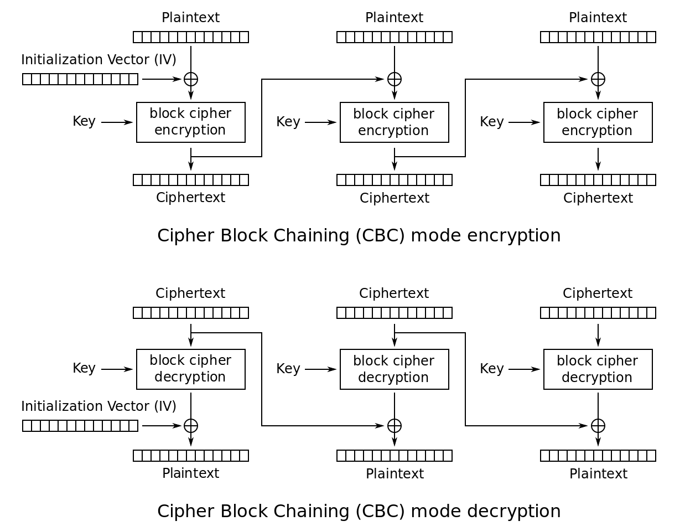

# Cipher Block Chaining
This script implements one encryption/decryption systems in CBC mode of operation. We use AES for  decryption and encryption of each 16-byte block. The 16-byte encryption IV is chosen at random and is prepended to the ciphertext.The PKCS#5/#7 padding scheme is used.

# Theory
- [Cipher Block Chaining](https://en.wikipedia.org/wiki/Block_cipher_mode_of_operation#Cipher_Block_Chaining_(CBC))
```
Encryption parallelizable:  No
Decryption parallelizable:  Yes
Random read access: Yes

```
- [AES (Advanced Encryption Standard)](https://en.wikipedia.org/wiki/Advanced_Encryption_Standard)
- [PKCS #5/#7 padding scheme](https://en.wikipedia.org/wiki/Padding_(cryptography)#PKCS#5_and_PKCS#7) as described in [RFC 5652](https://tools.ietf.org/html/rfc5652#section-6.3)
```
01
02 02
03 03 03
04 04 04 04
05 05 05 05 05
06 06 06 06 06 06
etc.
```

# Dependency
- [pyca/cryptography](https://cryptography.io/en/latest/)

# Sample Usage

### Decryption
```
$ python cbc.py

-------------
Decrypt or Encrypt using CBC AES (16-byte blocks PKCS5 Padding Scheme).
-------------
Enter 16 byte hex-encoded key: 140b41b22a29beb4061bda66b6747e14
Enter 1 to decrypt, or 2 to encrypt:1
Enter hex-encoded cipher to decrypt: 4ca00ff4c898d61e1edbf1800618fb2828a226d160dad07883d04e008a7897ee2e4b7465d5290d0c0e6c6822236e1daafb94ffe0c5da05d9476be028ad7c1d81

Decrypted message:
Basic CBC mode encryption needs padding.

Press any key to exit.
```

### Encryption
```
$ python cbc.py

-------------
Decrypt or Encrypt using CBC AES (16-byte blocks PKCS5 Padding Scheme).
-------------
Enter 16 byte hex-encoded key: 140b41b22a29beb4061bda66b6747e14
Enter 1 to decrypt, or 2 to encrypt: Basic CBC mode encryption needs padding
Invalid action.
Enter 1 to decrypt, or 2 to encrypt: 2
Enter message in plaintext to encrypt: Basic CBC mode encryption needs padding

Encrypted message:
585f697715a16019433ad577bc3a51324b76e17008d484e7fa9403411f7922b6e938e172115e0a2960ff403c981ed973

Press any key to exit.
```

# Two Test Cases
- Key: `140b41b22a29beb4061bda66b6747e14`

### Cipher 1
- The following cipher decrypts to `Basic CBC mode encryption needs padding.`
when the key above is used
```
4ca00ff4c898d61e1edbf1800618fb28
28a226d160dad07883d04e008a7897ee
2e4b7465d5290d0c0e6c6822236e1daa
fb94ffe0c5da05d9476be028ad7c1d81
```

### Cipher 2
- The following cipher decrypts to `Our implementation uses rand. IV`
when the key above is used.
```
5b68629feb8606f9a6667670b75b38a5
b4832d0f26e1ab7da33249de7d4afc48
e713ac646ace36e872ad5fb8a512428a
6e21364b0c374df45503473c5242a253"
```
