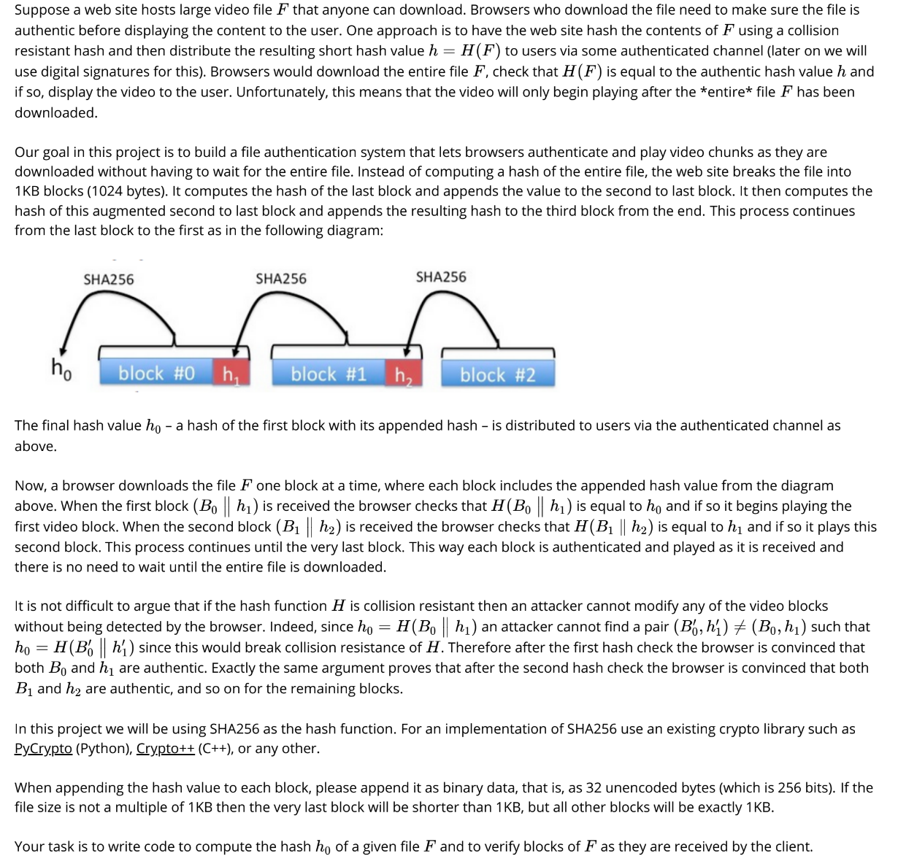

# About
- A simple file authentication system that simulate how you'd be able to authenticate and play video chunks as they are downloaded without having to wait for the entire file.

## Description


# Sample Usage
- The final hash value h0 (hash of the first block with its appended hash) is distributed to users via the authenticated channel.

### Help
```
$ python script.py --help
usage: script.py [-h] [-i BUFFERSIZE] action src dst hash

Simple File Authentication System. Authenticate and decode a received byte
stream or sign and write the bytestream to send.

positional arguments:
  action         SIGN/VERIFY, encode to write a bytestream to send, decode to
                 read and verify a bytestream
  src            Path to read bytes
  dst            The path to write bytes
  hash           This is NOT need for signing.

optional arguments:
  -h, --help     show this help message and exit
  -i BUFFERSIZE  Number of bytes per chunk of data (default: 1024 bytes.)
```

### Sign
```
$ python script.py SIGN ./data/video1.mp4 ./data/SIGNED.bin -1024
Signing...
Writing hash in memory...
Hashes depleted.
h0:  5b96aece304a1422224f9a41b228416028f9ba26b0d1058f400200f06a589949
File created:  ./data/SIGNED.bin
```

### Verify
```
$ python script.py VERIFY ./data/SIGNED.bin ./data/VERIFED.mp4 5b96aece304a1422224f9a41b228416028f9ba26b0d1058f400200f06a589949
h0:  5b96aece304a1422224f9a41b228416028f9ba26b0d1058f400200f06a589949
Verifying...
File created:  ./data/VERIFED.mp4
```
