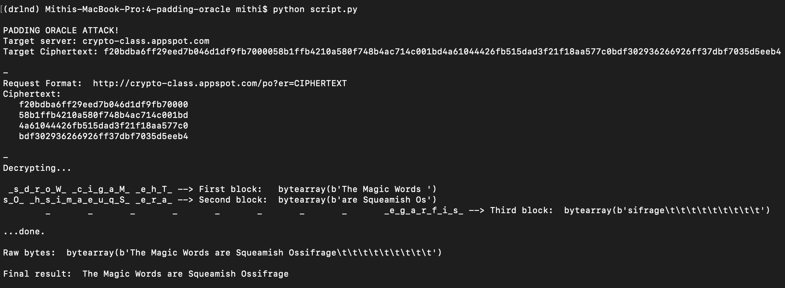

# About
- This script illustrates how you'd be able to decrypt an intercepted ciphertext if the receiver reveals whether a sent ciphertext is of valid format or not. This shows that when using encryption you must prevent padding oracle attacks by either using encrypt-then-MAC
as in EAX or GCM, or if you must use MAC-then-encrypt then ensure that the site treats padding errors the same way it treats MAC errors.

### Website behavior
When a decrypted CBC ciphertext ends in an invalid pad, the web server returns a 403 error code (forbidden request).
When the CBC padding is valid, but the message is malformed,the web server returns a 404 error code (URL not found).

### Our Power
- We can sending arbitary http request (`get`) to this website of the form::
```
http://THE.IP.ADDRESS/po?er=ARBITRARY_HEX_ENCODED_CIPHERTEXT_HERE
```

### Our Goal
- Decrypt a hex-encoded ciphertext; string of 128 characters in length,which represents
 a 16-byte initialization vector (IV) and three blocks of encrypted message. (16 bytes per block)
- The decrypted message is expected to be in utf-8 with PKCS #5/#7 padding scheme.

# Sample Usage
```
$ python script.py
```


# Running the tests
### 1. Run the toy server
```
$ python toyserver.py
Serving at localhost : 9000
```

- `toyserver.py` is dependent on: [pyca/cryptography](https://cryptography.io/en/latest/)
- The key is: `140b41b22a29beb4061bda66b6747e14`

### 2. Run the test
```
$ pytest
```


```
--------------
Case A
--------------
SERVER > localhost:9000
TARGET > 4ca00ff4c898d61e1edbf1800618fb2828a226d160dad07883d04e008a7897ee2e4b7465d5290d0c0e6c6822236e1daafb94ffe0c5da05d9476be028ad7c1d81

--------------
Case B
--------------
SERVER > crypto-class.appspot.com
TARGET > f20bdba6ff29eed7b046d1df9fb7000058b1ffb4210a580f748b4ac714c001bd4a61044426fb515dad3f21f18aa577c0bdf302936266926ff37dbf7035d5eeb4
```
